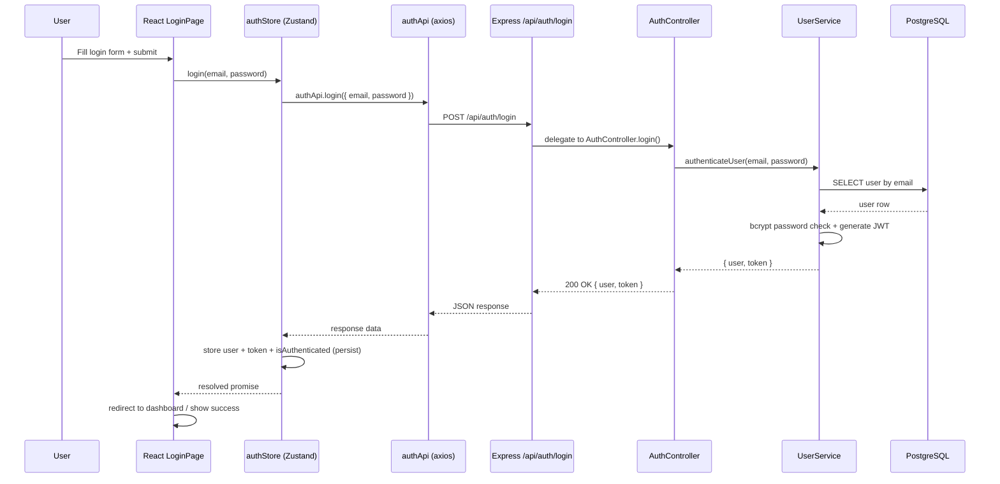
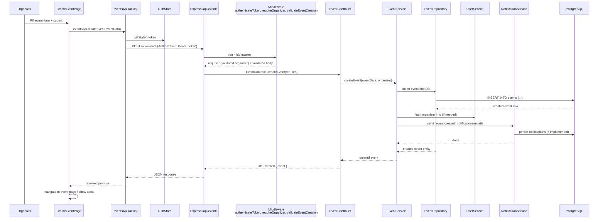
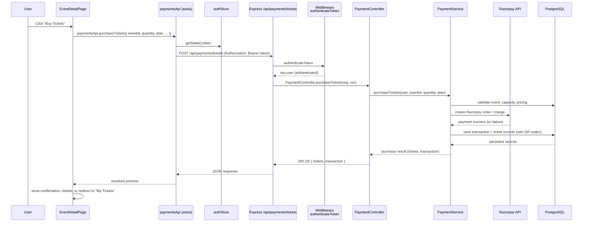

## Community Event Board – Architecture Overview

### 1. High-Level Summary

- **What it is**: A community event discovery and management platform with:
  - **Auth**: registration, login, email verification, password reset.
  - **Events**: search, view, create/update/delete, publish/cancel, capacity & analytics.
  - **Registrations & tickets**: users register for events, organizers see attendees.
  - **Payments**: subscriptions + ticket purchases via Razorpay.
  - **Profiles & media**: user profiles and avatars.
- **Tech stack**:
  - **Backend**: Node.js 18+, TypeScript, Express, PostgreSQL, Redis, Socket.IO, Razorpay, Nodemailer.
  - **Frontend**: React 18, TypeScript, Vite, Tailwind CSS, Zustand, React Query, React Router.
  - **Testing**: Jest, fast-check, Playwright (targets 90%+ coverage).

---

### 2. Top-Level Project Layout

```text
src/
  server/              # Backend API (Express + TS)
    config/            # DB initialization (PostgreSQL, Redis)
    controllers/       # HTTP controllers per domain
    services/          # Business logic
    repositories/      # Data access layer (pg queries)
    models/            # Domain models (Event, User, Registration, Payment, Review)
    middleware/        # auth (JWT, roles), validation (express-validator)
    routes/            # Express routers (auth, events, payments, registrations, reviews, users)
    __tests__/         # Service-level tests
    server.ts          # Express app & bootstrap

  client/              # Frontend React SPA
    src/
      components/      # Layout & auth components (Header, Footer, ProtectedRoute)
      pages/           # Route-level screens (Home, Events, Dashboard, etc.)
      services/        # API client (axios wrappers)
      store/           # Zustand auth store
      index.css        # Tailwind base styles
      App.tsx          # Routing & app shell
      main.tsx         # React entrypoint

  shared/              # Shared TS types/interfaces/models (client + server)
    interfaces/
    models/
    types/

  test/                # Jest / test setup
```

---

### 3. Backend Architecture

#### 3.1 Backend Entry Point (`src/server/server.ts`)

Responsibility of `server.ts`:

- Load environment variables via `dotenv`.
- Create and configure the Express app:
  - Security: `helmet`, CORS with environment-aware origins.
  - Rate limiting: `express-rate-limit` with configurable window and max.
  - Body parsing: JSON + URL-encoded with size limits.
- Health check:
  - `GET /health` → basic JSON status, timestamp, version.
- Mount routers:
  - `/api/auth`           → `routes/auth.ts`
  - `/api/events`         → `routes/events.ts`
  - `/api/registrations`  → `routes/registrations.ts`
  - `/api/reviews`        → `routes/reviews.ts`
  - `/api/payments`       → `routes/payments.ts`
  - `/api/users`          → `routes/users.ts`
- Global 404 handler for unknown routes.
- Global error handler (sanitized messages in production, stack traces in dev).
- Initialize database connections via `initializeDatabase` from `config/database.ts`.
- Start the HTTP server on `PORT` (default `3000`).
- Graceful shutdown on `SIGTERM` / `SIGINT`:
  - Close HTTP server.
  - Close DB connections via `closeDatabase`.
- Process-level safety:
  - Handle `unhandledRejection` and `uncaughtException` by logging and exiting.

#### 3.2 Standard Backend Layering

Each domain (auth, events, payments, registrations, reviews, users) follows this pattern:

```text
Route (Express Router)
  -> Controller (HTTP-level logic)
  -> Service (business rules, orchestration)
  -> Repository (database access)
  -> PostgreSQL (via pg)
```

- **Routes (`src/server/routes/*.ts`)**
  - Instantiate repositories and services.
  - Instantiate domain controllers.
  - Define HTTP endpoints and attach middleware.
  - Pass `req`/`res` into controller methods.

- **Controllers (`src/server/controllers/*.ts`)**
  - Translate HTTP requests into service calls.
  - Map service results to HTTP responses (`status`, JSON body).
  - Handle known errors and pass unexpected ones to the global error handler.

- **Services (`src/server/services/*.ts`)**
  - Implement core business workflows:
    - Example: create event, publish/cancel event, register user, purchase tickets.
  - Call one or more repositories.
  - Use cross-cutting services like:
    - `EmailService` (transactional emails).
    - `NotificationService` (notification logic, may combine email + other channels).
    - `UserService` (user domain logic).

- **Repositories (`src/server/repositories/*.ts`)**
  - Encapsulate SQL queries via `pg`.
  - CRUD + richer queries for each domain model:
    - Users, Events, Registrations, Reviews, Payments/Transactions.

- **Middleware (`src/server/middleware/*.ts`)**
  - `auth.ts`:
    - `authenticateToken`: parses `Authorization: Bearer <token>`, verifies JWT, attaches user to `req`.
    - `requireOrganizer`: ensures `req.user.role` is an organizer for organizer-only endpoints.
  - `validation.ts`:
    - `validateUserRegistration`, `validateUserLogin`, `validateEventCreation`, etc.
    - Uses `express-validator` to ensure data integrity at the HTTP boundary.

#### 3.3 Example: Auth Domain

**Route:** `src/server/routes/auth.ts`

- Creates:
  - `UserRepository`
  - `EmailService`
  - `UserService`
  - `AuthController`
- Defines:
  - Public endpoints:
    - `POST /api/auth/register`
    - `POST /api/auth/login`
    - `POST /api/auth/refresh-token`
    - `GET  /api/auth/verify-email`
    - `POST /api/auth/request-password-reset`
    - `POST /api/auth/reset-password`
  - Protected endpoints (JWT required):
    - `POST /api/auth/logout`
    - `POST /api/auth/change-password`

**High-level flow (login)**:

```text
Client POST /api/auth/login
  -> AuthController.login
    -> UserService.authenticateUser
      -> UserRepository.getByEmail
      -> bcrypt password comparison
      -> JWT / refresh token generation
    <- { user, token }
  <- 200 OK { user, token }
```

#### 3.4 Example: Events Domain

**Route:** `src/server/routes/events.ts`

- Constructs:
  - `EventRepository`
  - `UserRepository`
  - `EmailService`
  - `UserService`
  - `NotificationService`
  - `EventService`
  - `EventController`

- Endpoints:
  - Public:
    - `GET /api/events/search` → advanced search with query params.
    - `GET /api/events/` → uses search to list all events (unless filtered by query).
    - `GET /api/events/:id` → single event details.
    - `GET /api/events/:id/capacity` → remaining capacity.
  - Protected (JWT + organizer role):
    - `POST /api/events/` → create event.
    - `PUT /api/events/:id` → update event.
    - `DELETE /api/events/:id` → delete event.
    - `POST /api/events/:id/publish` → publish event.
    - `POST /api/events/:id/cancel` → cancel event with reason.
    - `GET /api/events/my/events` → organizer’s events.
    - `GET /api/events/:id/attendees` → list attendees.
    - `GET /api/events/:id/analytics` → analytics summary.

---

### 4. Frontend Architecture

#### 4.1 Entry & Routing (`src/client/src/main.tsx`, `App.tsx`)

- **`main.tsx`**:
  - Creates React root with `ReactDOM.createRoot`.
  - Renders `<App />` inside `<React.StrictMode>`.

- **`App.tsx`**:
  - Initializes **React Query** with a `QueryClient` (retry once, no refetch on window focus).
  - Reads `initializeAuth` from `useAuthStore` and calls it once on mount to restore auth state.
  - Wraps application with:
    - `<QueryClientProvider>`
    - `<BrowserRouter>`
    - Layout: `<Header />`, `<Footer />`.
    - `<Toaster />` for toast notifications.
  - Defines routes:
    - Public:
      - `/` → `HomePage`
      - `/events` → `EventsPage`
      - `/events/:id` → `EventDetailPage`
      - `/login` → `LoginPage`
      - `/register` → `RegisterPage`
      - `/pricing` → `PricingPage`
      - `/help` → `HelpPage`
      - `/contact` → `ContactPage`
      - `/privacy` → `PrivacyPage`
      - `/terms` → `TermsPage`
    - Protected:
      - `/dashboard` → `DashboardPage` (wrapped in `<ProtectedRoute>`).
      - `/create-event` → `CreateEventPage` (wrapped in `<ProtectedRoute requireOrganizer>`).

#### 4.2 Global State – Auth (`src/client/src/store/authStore.ts`)

- Uses **Zustand** with `persist` middleware:
  - State:
    - `user: User | null`
    - `token: string | null`
    - `isAuthenticated: boolean`
    - `isLoading: boolean`
  - Actions:
    - `login(email, password)`:
      - Calls `authApi.login({ email, password })`.
      - Stores `{ user, token }` and sets `isAuthenticated = true`.
    - `register(userData)`:
      - Calls `authApi.register(userData)`.
      - Stores `{ user, token }` and sets `isAuthenticated = true`.
    - `logout()`:
      - Clears `user`, `token`, `isAuthenticated`.
    - `initializeAuth()`:
      - On app start, if a `token` exists in persisted state, marks `isAuthenticated = true`.
  - Persistence:
    - Stored under key `auth-storage` in `localStorage`.
    - Persists only: `user`, `token`, `isAuthenticated`.

#### 4.3 API Client (`src/client/src/services/api.ts`)

- Creates a shared **axios instance**:
  - `baseURL` = `VITE_API_BASE_URL` or `http://localhost:3000/api`.
  - Default headers: `Content-Type: application/json`.

- **Request interceptor**:
  - Reads token from `useAuthStore.getState().token`.
  - If present, sets `Authorization: Bearer <token>` on outbound requests.

- **Response interceptor**:
  - If response status is `401`:
    - Calls `useAuthStore.getState().logout()`.
    - Redirects to `/login`.

- **Exposed API groups**:
  - `authApi`:
    - `login`, `register`, `logout`, `refreshToken`, `requestPasswordReset`, `resetPassword`.
  - `eventsApi`:
    - Search & browse: `searchEvents`, `getEvent`, `getEventCapacity`.
    - CRUD & management: `createEvent`, `updateEvent`, `deleteEvent`, `publishEvent`, `cancelEvent`.
    - Organizer-focused: `getMyEvents`, `getEventAttendees`, `getEventAnalytics`.
    - Registrations: `registerForEvent`, `getUserRegistrations`.
  - `usersApi`:
    - `getProfile`, `updateProfile`, `uploadAvatar` (multipart/form-data).
  - `paymentsApi`:
    - Subscription: `createSubscription`, `getSubscription`, `cancelSubscription`.
    - Tickets: `purchaseTickets`, `getTickets`.
    - Financials: `getTransactions`.

#### 4.4 Routing Protection (`ProtectedRoute`)

- Reads auth state from `useAuthStore` (and optionally user role).
- If user is **not authenticated**:
  - Redirects to `/login`.
- If `requireOrganizer` is true and user’s `role` is not organizer:
  - Redirects or shows an access denied state.
- Otherwise:
  - Renders children (protected page, e.g. dashboard or create-event).

---

### 5. End-to-End Interaction Diagrams

#### 5.1 Auth Flow – User Login



#### 5.2 Events Flow – Organizer Creates an Event



#### 5.3 Payments Flow – User Purchases Tickets



---

### 6. Mental Model Cheat Sheet

- **Overall pipeline**:

```text
React SPA (client)
  -> axios API client (services/api.ts)
  -> Express routes (src/server/routes)
  -> Controllers (src/server/controllers)
  -> Services (src/server/services)
  -> Repositories (src/server/repositories)
  -> PostgreSQL + Redis + Razorpay + Email
```

- **Key starting points to explore the code**:
  - Backend:
    - `src/server/server.ts` – Express setup and route mounting.
    - `src/server/routes/*.ts` – endpoint definitions and wiring.
    - `src/server/services/*.ts` – business logic.
  - Frontend:
    - `src/client/src/App.tsx` – routing & app shell.
    - `src/client/src/store/authStore.ts` – auth state and login/register logic.
    - `src/client/src/services/api.ts` – how the client talks to the backend.

This file is designed to be a single, self-contained overview of the BLR/Community Event Board project so you can quickly onboard, reason about flows, and navigate the codebase.


